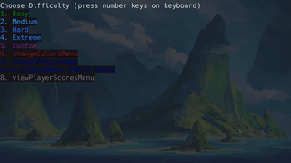
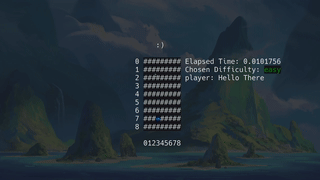
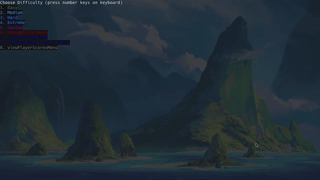

# ncursesMinesweeper


> A minesweeper clone with an ncurses UI that runs in the terminal

> Can play with either mouse or keyboard

## Gameplay

> keyboard gameplay (cool RAINBOW cursor included!)



> Mouse gameplay



> customBoardMenu, changeColorsMenu, changePlayerNameMenu, viewPlayerScoresMenu




## Gameplay Controls

| mouse | action |
| --- | --- |
| LMB | clear under mouseCursor |
| RMB | flag under mouseCursor |
| Hold-LMB | flag under mouseCursor |

| keyboard | action |
| --- | --- |
| ~ | quit at any-point |
| q | go back to previous screen / quit current game |
| SPACE | clear under keyboardCursor |
| f | flag under keyboardCursor |
| h | keyboardCursor left |
| j | keyboardCursor down |
| k | keyboardCursor up |
| l | keyboardCursor right |
| 0-9 | repeat keyboardCursor move action *n* times |
| b | toogle keyboardCursor blink |
| s | toggle keyboardCursor show |

# INSTALLATION

> This project uses ncurses
>  
> This will not run on non-posix compliant shells
>  
> may or may not make a [pdcurses](https://pdcurses.org/) fork in the future (for Windows support)

## Linux

Dependencies:

> make >= 4.4.1

> clang >= 18.1.8 

1. Use your distro's package manager to install ncurses library
```shell
# for arch-linux-based-distros:
pacman -Sy ncurses
```

2. Clone the repo and cd into it
```shell
git clone https://github.com/AmberGraph41161/ncursesMinesweeper && cd ncursesMinesweeper
```

3. Run provided Makefile to create binary
```shell
Make
```

4. Run the binary file and enjoy!
```
./main
```

# Documentation

This project makes use of [Doxygen](https://www.doxygen.nl/) to document the
code behind it. You can generate this documentation by doing to following:

1. To generate the PDF documentation via texlive (LATEX) and Doxygen, first
   resolve dependencies
```shell
pacman -Sy texlive doxygen
```

2. Run doxygen while in the project root on the provided Doxyfile
```shell
doxygen
```

3. CD into the output directory and run make
```shell
cd doxygenOutput/latex/ && make
```

4. View the newly created refman PDF with your favorite PDF viewer
```shell
zathura refman.pdf
```

# Please view only

This project is available for **viewing only**.
You are welcome to read and explore the source code, but **you may not copy, modify, or distribute** the code under any circumstances.
All rights are reserved to the original author.

For any requests regarding usage, please contact the author directly.
